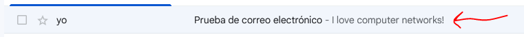
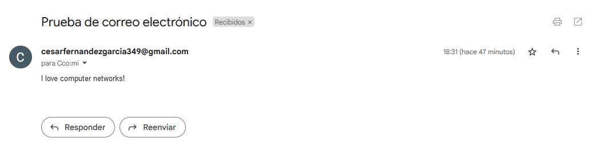
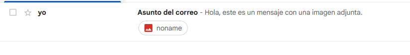

# A3yA4

Tareas de RC 3 y 4 de programacion

# Fotos que muestra la evidencia de que recibí el correo

# Contenido de cada archivo

MailClient.py contiene la solucion del asigment 3 de crear un cliente de correo sin usar smtplib, y usando smtp, contiene la solución del obligatorio más el primer opcional

MailClientImage.py contiene la opcion agregada de enviar una imagen
